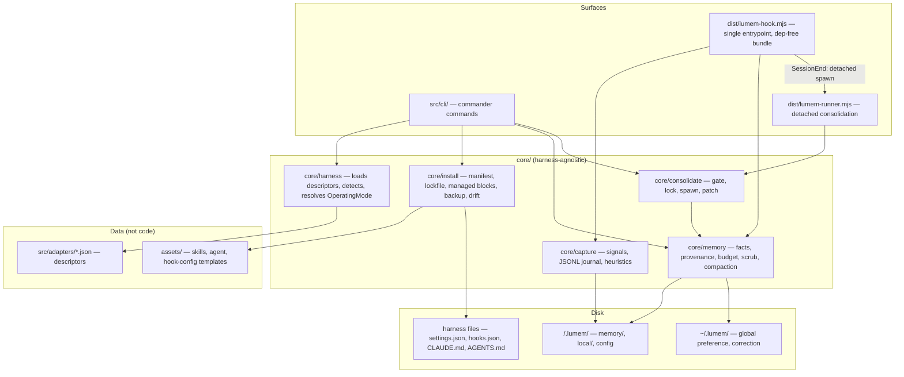

# lumem V1 — Design

**Spec**: [spec.md](spec.md) · **PRD**: [PRD.md](PRD.md)
**Status**: Draft
**Date**: 2026-08-07

---

## 0. Research — verified harness facts (2026-08-07)

Verified against official docs and source (`anthropics/claude-code`, `openai/codex`). The PRD §7.1 table was partially out of date; **these facts supersede the PRD** and feed the adapter descriptors.

| Fact | Claude Code | Codex CLI |
|---|---|---|
| Current version (freeze as the minimum in M0) | 2.1.224 | 0.147.0 |
| Hook events | 30+ (all the ones we need: `SessionStart`, `SessionEnd`, `UserPromptSubmit`, `PostToolUse`, …) | **11** (not 5): includes `SessionStart`, `SessionEnd`, `UserPromptSubmit`, `PreToolUse`, `PostToolUse`, `Stop`, `SubagentStart/Stop`, `PreCompact`, `PostCompact`, `PermissionRequest` |
| Hook status | Stable | **Stable, on by default** — flag `[features] hooks` (`codex_hooks` = deprecated alias). The PRD said "experimental" |
| Hook config | `~/.claude/settings.json`, `.claude/settings.json`, `.claude/settings.local.json`; merged across levels; per-hook `timeout` | `~/.codex/hooks.json` or `[hooks]` in `config.toml` (user) and `.codex/hooks.json` or `.codex/config.toml` (project); merged across layers |
| Context in the hook | stdin JSON (`session_id`, `cwd`, `transcript_path`, …) + env `CLAUDE_PROJECT_DIR` | stdin JSON with `cwd` present; no project env vars |
| **Context injection** | `SessionStart`/`UserPromptSubmit`: stdout on exit 0 becomes context (or JSON `hookSpecificOutput.additionalContext`, 10,000-char ceiling) | **Same: `SessionStart` stdout on exit 0 injects context.** The PRD assumed it did not |
| Hook trust | — | Confirmed: unmanaged hooks require trust via `/hooks` (hash persisted); warning at startup |
| Windows hooks | Yes | **Yes** (`command_windows` per hook). The PRD said no — V1 keeps Windows = skill-only by scope decision, not by platform limitation |
| Skills (project / global) | `.claude/skills/` / `~/.claude/skills/` | **`.agents/skills/` / `~/.agents/skills/`** — `~/.codex/skills` is deprecated compat. The PRD pointed at `.codex/skills` |
| Project doc | `CLAUDE.md` | `AGENTS.md`, combined limit 32 KiB by default, configurable via `project_doc_max_bytes` |
| Hook exit codes | 0 = ok (stdout may inject); 2 = blocking (we don't use it); any other ≠ 0 = non-blocking warning | 0 = ok, same model |

**Design consequences:**
1. Primary injection = **hook stdout on both harnesses**. The fallback chain (PRD §7.3) stays in the descriptor as data, for a future harness without that capability.
2. Codex descriptor corrected: skills in `.agents/skills`, hooks stable with no flag.
3. The default injection ceiling (4 KB) fits comfortably inside Claude Code's 10,000-char limit.

---

## Architecture Overview

Four layers. `core/` is 100% harness-agnostic (principle 5): everything harness-specific enters as a **JSON descriptor** (data) and **templates in `assets/`** (data). Hooks are thin, bundled entrypoints that call into `core/`.



Consolidation lifecycle (the only flow with process subtlety):

```mermaid
sequenceDiagram
    participant H as Harness (SessionEnd)
    participant HK as lumem-hook.mjs
    participant R as lumem-runner.mjs (detached)
    participant LLM as claude -p / codex exec
    participant M as .lumem/memory/*

    H->>HK: stdin JSON (sessionId, cwd)
    HK->>HK: cheap gate pre-check (signal count, timestamps)
    alt gate passes
        HK->>R: spawn(detached, unref)
    end
    HK-->>H: immediate exit 0 (never blocks)
    R->>R: re-checks gate + acquires lock (O_EXCL, TTL 30min)
    R->>LLM: lumem-consolidate prompt + journal + current memory
    LLM-->>R: JSON patch {add, replace, remove}
    R->>R: validates schema + scrubs secrets
    R->>M: applies atomically (tmp + rename); on failure nothing changes
    R->>R: releases lock, logs, updates state.json
```

---

## Code Reuse Analysis

Greenfield — reuse = ecosystem choices, minimized by NFR-5/6 (zero native deps, single lean hook bundle).

| Dependency | Used in | Why |
|---|---|---|
| `commander` | `src/cli/` only | Ubiquitous, zero transitive deps, TS types |
| `zod` | CLI + runner only — **never in the hook bundle** | Validation of descriptor, config, lockfile, LLM patch |
| `tsup` (dev) | Multi-entry build | Produces `cli.js`, `lumem-hook.mjs`, `lumem-runner.mjs` as single bundles (NFR-6) |
| `vitest` (dev) | Tests | Fast, native ESM |
| `@biomejs/biome` (dev) | Lint + format | One tool, no sprawling config |
| node builtins | Everything else | `fs`, `crypto` (fact/lockfile hashing), `child_process` (spawn), `path`, `os` |

**Deliberately without a dependency:** file locking (O_EXCL by hand), terminal colors, a read-only TOML parser is not needed in V1 (Codex hook-config writing uses `hooks.json`, not `config.toml` — see Tech Decisions), secret scanner (our own regex + entropy).

### Integration Points

| System | Method |
|---|---|
| Claude Code | Hooks via a managed block in `.claude/settings.json`; skills symlinked into `.claude/skills/`; optional context in `CLAUDE.md` (managed block) |
| Codex | Hooks via `.codex/hooks.json` (own file when it doesn't exist; managed block if pre-existing); skills symlinked into `.agents/skills/`; `AGENTS.md` (managed block, respecting 32 KiB) |
| Headless LLM | The descriptor's `headless` template: `claude -p` / `codex exec`; prompt via stdin; JSON response |
| Git | `.lumem/.gitignore` generated covering `local/`; project memory committable |

---

## Components

### core/harness — detection and mode engine

- **Purpose**: load/validate descriptors, detect harnesses, resolve the operating mode with fallbacks.
- **Location**: `src/core/harness/`
- **Interfaces**:
  - `loadDescriptors(dir: string): AdapterDescriptor[]` — parse + zod; an invalid descriptor → an error naming the field, harness excluded (HARN-02)
  - `detect(d: AdapterDescriptor): DetectionResult` — evaluates `dir` | `bin` | `file` rules; includes the version via `--version` when a `bin` is present
  - `resolveMode(d: AdapterDescriptor, det: DetectionResult): OperatingMode` — missing capabilities ⇒ the declared fallback; it never "disappears", it degrades (HARN-03)
- **Dependencies**: zod, node builtins.
- **Reuses**: —

### core/install — transactional installer

- **Purpose**: bring the disk to the state declared in the manifest, reversibly and idempotently.
- **Location**: `src/core/install/`
- **Interfaces**:
  - `plan(manifest, lock, modes, opts): InstallPlan` — diff of desired × lockfile × disk; pure, no write I/O (this is what `--dry-run` prints)
  - `apply(plan, opts): ApplyReport` — executes; every action is logged in the lockfile
  - `upsertManagedBlock(file, content, markers): BlockResult` — touches only between `<!-- lumem:start -->` / `<!-- lumem:end -->` (INST-05); creates the file if absent
  - `removeManagedBlock(file): void` — restores the state without the block
  - `backupOnce(path): string` — timestamped copy in `.lumem/local/backups/<ts>/<relpath>` before the 1st write (INST-06)
  - `detectDrift(lock, disk): DriftReport` — real hash ≠ lockfile hash (INST-04)
- **Dependencies**: core/harness (modes), assets.
- **Reuses**: —

### core/memory — storage and budget

- **Purpose**: read/write facts with provenance, assemble the injection block within budget, refuse secrets.
- **Location**: `src/core/memory/`
- **Interfaces**:
  - `readStore(scope: Scope): MemoryStore` — tolerant parser: a malformed entry is skipped and logged, never a crash
  - `addFact(store, fact): void` / `removeFact(store, factId): boolean` / `search(stores, q): Fact[]`
  - `writeStore(store): void` — atomic (tmp + rename); **the single choke point for durable writes** — `scanSecrets` runs here, covering both manual `memory add` AND the consolidation patch (MEM-05)
  - `buildInjection(stores, budgetBytes): string` — priority: recent corrections → project (decisions/risks) → preference; truncates whole entries, never mid-entry (MEM-03)
  - `scanSecrets(text): SecretHit[]` — regexes (AKIA…, PEM headers, JWT, `KEY=` with a high-entropy value ≥ 20 chars) + Shannon entropy
  - `checkSoftLimits(store, config): CompactionFlag[]` — flags in `state.json` (MEM-04)
  - `ensureGitignore(lumemDir): void` (MEM-06)
- **Fact → ID**: `sha256(normalized body)[0:8]`. Derived, not stored — the on-disk format stays exactly the one from PRD §5.3; `memory list` shows the computed id; `forget <id>` resolves against it.
- **Dependencies**: node builtins.
- **Reuses**: —

### core/capture — signals and journal

- **Purpose**: turn hook events into typed signals appended to the session journal. No LLM, no durable writes (CAP-01, CAP-03).
- **Location**: `src/core/capture/`
- **Interfaces**:
  - `appendSignal(sessionsDir, sessionId, signal): void` — JSONL, `O_APPEND`, one line per signal
  - `classifyPrompt(text, markers): string | null` — correction heuristic; markers come from the config (default: "na verdade", "não, faz", "sempre que", "nunca", "actually", "no, do", "always", "never")
  - `detectRecovery(journalTail, newCmd): Signal | null` — a command that failed before and passes now; reads only a bounded tail of the journal itself (no extra state)
  - `redact(text, maxLen): string` — truncates the prompt (default 500 chars) and scrubs secrets before writing to the journal
- **Dependencies**: node builtins. **Never zod** (it runs on the hook path).
- **Reuses**: `scanSecrets` from core/memory (shared function, extracted to `core/shared/secrets.ts`).

### core/consolidate — gate, lock, patch

- **Purpose**: decide whether to consolidate, run the detached headless LLM, apply the patch atomically.
- **Location**: `src/core/consolidate/`
- **Interfaces**:
  - `checkGate(state, journal, config): GateResult` — the 4 conditions from PRD §6 (CONS-01); cheap enough for the hook path
  - `acquireLock(localDir, ttlMin): Lock | null` — `open(O_CREAT|O_EXCL)` with `{pid, startedAt}`; a lock older than the TTL is stale, removed and re-acquired (CONS-05)
  - `spawnRunner(runnerPath, args): void` — `spawn(process.execPath, […], {detached: true, stdio: 'ignore'}).unref()` (CONS-02)
  - `runConsolidation(ctx): Report` — the runner's body: re-checks the gate, the lock, assembles the prompt (lumem-consolidate skill + journal + memory), invokes the descriptor's `headless`, parses
  - `applyPatch(patch, stores): PatchReport` — zod-validated; **all or nothing**: any invalid entry or one carrying a secret ⇒ the entry is dropped and logged; a structural failure ⇒ memory untouched
- **Dependencies**: core/memory, zod (runner only).
- **Reuses**: the `headless` descriptor from core/harness.

### hooks — single bundled entrypoint

- **Purpose**: bridge harness → core with absolute fail-open.
- **Location**: `src/hooks/main.ts` → `dist/lumem-hook.mjs` (single bundle, builtins only)
- **Invocation contract**: `node lumem-hook.mjs <harnessId> <lumemEvent>`; payload on stdin. lumem events: `inject` (SessionStart), `capture-prompt` (UserPromptSubmit), `capture-tool` (PostToolUse), `end` (SessionEnd).
- **Fail-open wrapper** (OPS-01, NFR-1/2):
  ```ts
  // pseudo — every event runs inside this
  const deadline = event === 'inject' ? 2000 : 100 // ms
  try {
    const out = await Promise.race([handle(event, stdin), timeout(deadline)])
    if (out) process.stdout.write(out)   // only inject produces stdout
  } catch (e) { appendLog(e) }           // log to local/, never noisy stderr
  process.exit(0)                        // ALWAYS, no exception
  ```
- **Project resolution**: `CLAUDE_PROJECT_DIR` when present, otherwise the payload's stdin `cwd` (fallback declared in the descriptor).
- **Dependencies**: none external. stdin validation done by hand (it is a shallow object).

### cli — commands

- **Purpose**: the human surface; thin commands that call core and format.
- **Location**: `src/cli/`
- **Interfaces**: one module per command (`init`, `install`, `sync`, `uninstall`, `status`, `doctor`, `memory/*`). All accept `--json` (read) and `--dry-run` (write) via the global context (CLI-10/11).
- **Exit codes**: `0` ok · `1` runtime error · `3` drift/incompatibility detected (for `doctor`/`sync` in CI).
- **Dependencies**: commander + all of core.

### assets — installable artifacts (data)

- **Location**: `assets/`
- Contents:
  - `skills/lumem-memory/SKILL.md` — the read/write contract during a session (MEM-07); includes the injection instruction for degraded mode
  - `skills/lumem-consolidate/SKILL.md` — the consolidation prompt with the anti-junk rules from PRD §5.4 + **the patch's JSON schema embedded** (CONS-03)
  - `agents/lumem-consolidator.md` — definition of the headless agent, cheap model by default (CONS-04)
  - `harness/<id>/hooks.tmpl.json` — hook-config template per harness (data, not code)

---

## Data Models

### AdapterDescriptor (`src/adapters/schema.ts`)

```typescript
type DetectRule =
  | { type: 'dir'; path: string }          // "~" expanded
  | { type: 'bin'; name: string; versionArgs?: string[] }
  | { type: 'file'; path: string }

type InjectionMechanism = 'hook-stdout' | 'context-doc-block' | 'skill-instruction'

interface AdapterDescriptor {
  id: string                               // 'claude-code' | 'codex' | future
  minVersion: string                       // frozen; doctor compares
  detect: DetectRule[]
  paths: {
    home: string                           // '~/.claude' | '~/.codex'
    skills: { project: string; global: string }
    hooksConfig: {
      scope: 'project' | 'global'
      path: string                         // '.claude/settings.json' | '.codex/hooks.json'
      format: 'json'
      strategy: 'merge-json' | 'own-file'  // settings.json = merge; hooks.json absent = own-file
    }[]
    contextDoc?: { project: string; maxBytes: number }  // 'CLAUDE.md' | 'AGENTS.md'
  }
  capabilities: {
    'hooks.sessionStart': boolean
    'hooks.sessionEnd': boolean
    'hooks.userPromptSubmit': boolean
    'hooks.postToolUse': boolean
    'hooks.envProjectDir': boolean
    'hooks.requiresTrust': boolean
    'hooks.stdoutInjection': boolean
    'platform.windows': boolean            // harness support; V1 installs skill-only on Windows regardless
  }
  eventMap: Partial<Record<'inject' | 'capturePrompt' | 'captureTool' | 'end', string>>
  injection: InjectionMechanism[]          // preference order; the first supported one wins
  headless: {
    command: string[]                      // ['claude', '-p', '--output-format', 'json'] | ['codex', 'exec']
    promptVia: 'stdin' | 'arg'
    modelFlag?: string                     // '--model'
    defaultModel?: string                  // cheap
  }
}
```

V1 descriptors (content, with the verified facts from §0):

```jsonc
// claude-code.json (essence)
{ "id": "claude-code", "minVersion": "2.1.224",
  "detect": [{ "type": "dir", "path": "~/.claude" }, { "type": "bin", "name": "claude" }],
  "paths": {
    "home": "~/.claude",
    "skills": { "project": ".claude/skills", "global": "~/.claude/skills" },
    "hooksConfig": [{ "scope": "project", "path": ".claude/settings.json", "format": "json", "strategy": "merge-json" }],
    "contextDoc": { "project": "CLAUDE.md", "maxBytes": 40000 }
  },
  "capabilities": { "hooks.sessionStart": true, "hooks.sessionEnd": true, "hooks.userPromptSubmit": true,
    "hooks.postToolUse": true, "hooks.envProjectDir": true, "hooks.requiresTrust": false,
    "hooks.stdoutInjection": true, "platform.windows": true },
  "eventMap": { "inject": "SessionStart", "capturePrompt": "UserPromptSubmit", "captureTool": "PostToolUse", "end": "SessionEnd" },
  "injection": ["hook-stdout", "skill-instruction"],
  "headless": { "command": ["claude", "-p", "--output-format", "json"], "promptVia": "stdin", "modelFlag": "--model", "defaultModel": "haiku" } }

// codex.json (essence — corrected vs the PRD)
{ "id": "codex", "minVersion": "0.147.0",
  "detect": [{ "type": "dir", "path": "~/.codex" }, { "type": "bin", "name": "codex" }],
  "paths": {
    "home": "~/.codex",
    "skills": { "project": ".agents/skills", "global": "~/.agents/skills" },
    "hooksConfig": [{ "scope": "project", "path": ".codex/hooks.json", "format": "json", "strategy": "own-file" }],
    "contextDoc": { "project": "AGENTS.md", "maxBytes": 32768 }
  },
  "capabilities": { "hooks.sessionStart": true, "hooks.sessionEnd": true, "hooks.userPromptSubmit": true,
    "hooks.postToolUse": true, "hooks.envProjectDir": false, "hooks.requiresTrust": true,
    "hooks.stdoutInjection": true, "platform.windows": true },
  "eventMap": { "inject": "SessionStart", "capturePrompt": "UserPromptSubmit", "captureTool": "PostToolUse", "end": "SessionEnd" },
  "injection": ["hook-stdout", "context-doc-block", "skill-instruction"],
  "headless": { "command": ["codex", "exec"], "promptVia": "stdin", "modelFlag": "--model" } }
```

### Fact (on-disk format = PRD §5.3, unchanged)

```typescript
interface Fact {
  id: string            // sha256(normalize(body))[0..8] — DERIVED on read, not written
  date: string          // YYYY-MM-DD
  body: string
  src: string           // 'sess_<id>' | 'manual'
  conf: 'low' | 'medium' | 'high'
  type: 'project' | 'preference' | 'correction'
  scope: 'project' | 'global'
}
// serialization: "- [2026-08-07] body…\n  <!-- src:sess_a1b2 conf:high -->"
```

### Signal (JSONL journal — one line each)

```typescript
type Signal =
  | { t: 'session'; ts: string; ev: 'start' | 'end'; harness: string; sessionId: string; cwd: string }
  | { t: 'file'; ts: string; path: string; tool: string }
  | { t: 'cmd'; ts: string; cmd: string; exit: number }              // cmd redacted/truncated
  | { t: 'recovery'; ts: string; failed: string; passed: string }    // learned trap
  | { t: 'correction'; ts: string; marker: string; prompt: string }  // prompt truncated to 500 chars + scrubbed
  | { t: 'memory-op'; ts: string; op: 'add' | 'forget'; factId?: string }
```

### ConsolidationPatch (the contract with the LLM — zod-validated in the runner)

```typescript
interface ConsolidationPatch {
  version: 1
  add:     { type: 'project' | 'preference' | 'correction'; scope: 'project' | 'global'; body: string; conf: 'low' | 'medium' | 'high' }[]
  replace: { targetId: string; body: string; conf: 'low' | 'medium' | 'high' }[]
  remove:  { targetId: string; reason: string }[]
}
// compaction is NOT a separate field: it is a patch with many remove/replace,
// triggered when state.json holds a CompactionFlag for the file
```

### Manifest / Lockfile

```typescript
interface ManifestArtifact {
  id: string
  kind: 'skill' | 'agent' | 'hook-bundle' | 'hook-config' | 'context-block'
  version: string                          // version of the lumem package
  srcPath: string                          // relative to assets/ or dist/
  hash: string                             // sha256 of the content
  dest: { harness: string; scope: 'project' | 'global'; relPath: string }
}

interface LockEntry {
  artifactId: string
  installedAt: string                      // ISO
  destPath: string                         // resolved absolute
  hash: string                             // of the installed content
  mode: 'symlink' | 'copy'
  backupPath?: string                      // 1st backup, if there was one
}
// lumem-lock.json = { version: 1, entries: LockEntry[] }
```

### LumemConfig (`lumem.config.json` project; `~/.lumem/config.json` global)

```typescript
interface LumemConfig {
  version: 1
  budgets: {
    injectionBytes: number                 // default 4096
    files: Record<'project' | 'correction' | 'preference', { lines: number; bytes: number }>
  }
  gate: { minSignals: number; minDurationMin: number; minHoursBetween: number; lockTtlMin: number }
  // defaults: 5 / 3 / 6 / 30
  consolidation: { enabled: boolean; runtime: 'auto' | string; model?: string }
  // 'auto' = the harness that captured the session (assumed decision #3)
  harnesses: Record<string, { minVersion: string; installMode: 'symlink' | 'copy'; scope: 'project' | 'global' }>
  heuristics: { correctionMarkers: string[] }
}
```

### OperatingMode / state.json

```typescript
interface OperatingMode {
  harness: string
  detected: boolean
  version?: string
  grade: 'full' | 'degraded' | 'skill-only' | 'unavailable'
  missing: string[]                        // missing capability keys
  fallbacks: Record<string, InjectionMechanism | 'manual'>  // what doctor reports (HARN-04)
}

interface LocalState {                     // .lumem/local/state.json
  lastConsolidationAt?: string
  compactionFlags: ('project' | 'correction' | 'preference')[]
}
```

---

## Error Handling Strategy

| Scenario | Handling | User impact |
|---|---|---|
| Internal exception in a hook | Full try/catch, log to `local/lumem.log`, `exit 0` | None — session intact (NFR-1) |
| Hook blows its internal deadline (100ms capture / 2s injection) | `Promise.race` cuts it off, logs, `exit 0` | None; a lost signal is acceptable |
| Malformed stdin in a hook | Defensive manual parse; discard, log, `exit 0` | None |
| Full disk / journal not writable | Append fails silently for the session; logs if the log is writable | None during the session |
| Invalid adapter descriptor | Error naming the field; harness excluded from operations | `doctor` shows the problem |
| Drift in a managed file | `sync` warns, does not overwrite without `--force` | Clear warning + diff |
| Invalid/unparseable LLM patch | Discarded entirely; memory intact; logged | None; `doctor` points at the last failure |
| Patch entry containing a secret | Entry discarded + logged; the rest of the patch applies | Nothing leaks (MEM-05) |
| Headless CLI missing/exit ≠ 0 during consolidation | Runner aborts cleanly, releases the lock, logs | None; consolidation waits for the next round |
| Active lock | Consolidation skipped silently (log) | None |
| Stale lock (> TTL) | Removed and re-acquired | None |
| Memory with malformed markdown | Tolerant parser: skips the entry, logs | Entry ignored, the rest works |
| Hook with a `cwd` outside a lumem project | Signal discarded with a log | None |
| Harness version < the minimum | `doctor` reports the incompatibility; the mode degrades explicitly | A warning, never a surprise |

---

## Tech Decisions (the non-obvious ones)

| Decision | Choice | Rationale |
|---|---|---|
| Hook entrypoint | **1 single bundle** (`lumem-hook.mjs`) dispatching on argv, not 1 file per event | 1 cold start path, simpler install, NFR-6 |
| Deps in the hook bundle | **Zero** (not even zod) — stdin validated by hand | Minimum cold start for p95 < 150ms |
| Consolidation runner | Separate bundle (`lumem-runner.mjs`), with zod | Detached → cold start irrelevant; strict patch validation where it matters |
| Codex hook config | Write **`.codex/hooks.json`** (not `[hooks]` in `config.toml`) | Manageable JSON with merge/own-file; avoids depending on a TOML parser/writer in V1 |
| Primary injection | hook stdout on both harnesses (verified in §0) | Identical mechanism; the descriptor's `injection[]` keeps fallbacks for a future harness |
| Fact ID | `sha256(body)[0:8]` derived, never written | The on-disk format stays PRD §5.3 untouched; `forget <id>` stable; no extra state |
| Secret scrub | A single choke point in `writeStore` + redaction in the journal | One place to audit; covers both manual add AND the patch (MEM-05) |
| Lock | O_EXCL + 30min TTL by hand | Trivial, zero deps, stale-safe |
| Command recovery detection | Bounded tail of the session's own journal | No parallel state; no race with other sessions |
| Windows V1 | CLI ok; hooks **not installed** (skill-only), even though Codex supports them | Scope decision (test matrix); recorded that it is not a platform limit |
| Compaction | It is a normal patch (remove/replace) triggered by a `CompactionFlag` | A single write path; the anti-junk rules apply the same |
| Patch application | Atomic per file (tmp + rename), structurally all-or-nothing; an invalid entry is dropped individually | Memory never sits in an intermediate state |
| Install idempotency | `plan()` pure = diff of desired × lock × disk; `apply()` executes only the deltas | `--dry-run` prints exactly the plan; running it N× = 0 deltas |

---

## Repository structure (refines PRD §15)

```
src/
  cli/                      # commander; one module per command
  core/
    harness/                # engine: load, detect, resolveMode
    install/                # plan/apply, managed blocks, backup, drift
    memory/                 # store, facts, budget, compaction flags
    capture/                # signals, journal, heuristics
    consolidate/            # gate, lock, runner-core, patch
    shared/                 # secrets.ts, log.ts (rotation), fsx.ts (atomic write)
  hooks/main.ts             # → dist/lumem-hook.mjs (bundle, zero deps)
  runner/main.ts            # → dist/lumem-runner.mjs (bundle, with zod)
  adapters/
    claude-code.json
    codex.json
    schema.ts               # zod schema of the descriptor
assets/
  skills/lumem-memory/SKILL.md
  skills/lumem-consolidate/SKILL.md
  agents/lumem-consolidator.md
  harness/claude-code/hooks.tmpl.json
  harness/codex/hooks.tmpl.json
```

---

## Testing Strategy

| Layer | Approach |
|---|---|
| Unit (core/*) | vitest + `mkdtemp` fixtures; fact parser with golden files; secret scanner with a positive/negative corpus |
| Install round-trip | Fake homes (`HOME` pointed at tmp) with pre-existing `CLAUDE.md`/`AGENTS.md` containing user content; `install → uninstall` ⇒ byte-identical outside `.lumem/` (P1.2 Independent Test) |
| Managed blocks | Golden tests: upsert/remove in files with and without the block, with user content before/after the markers |
| Hook chaos (P3.1) | A suite that injects an exception, a timeout, malformed stdin, a full disk (mocked fs) → assert exit 0 + log |
| Latency (CAP-04) | Bench script: 100 real executions of `node dist/lumem-hook.mjs`, assert p95 < 150ms; runs in CI |
| Consolidation | Mocked LLM (fixtures for a valid/invalid/secret-carrying patch); gate matrix; lock contention with 2 processes |
| Manual E2E | Real use on both harnesses (M3/M4 exit criteria) |

---

## Impact on the spec (no requirement changed)

- P2.1 AC7 ("the harness does not support hooks — Windows, Codex without the flag/trust"): Codex today supports stable hooks and Windows; the real skill-only case becomes **Windows by V1 scope decision** + a future harness without hooks. The AC stays valid exactly as written.
- P1.3 AC5 (injection fallback without `SessionStart`): it stays — the mechanism is declared in `injection[]`, exercisable in a test with a synthetic descriptor lacking the capability.
- Assumed decision #5 resolved with a concrete proposal: **Claude Code ≥ 2.1.224, Codex ≥ 0.147.0** (current as of the design date).
