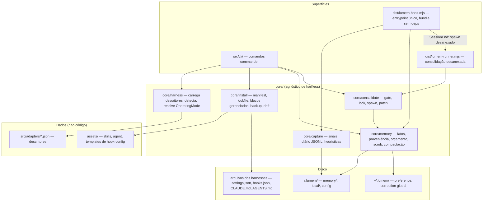

# lumem V1 — Design

**Spec**: [spec.md](spec.md) · **PRD**: [PRD.md](PRD.md)
**Status**: Draft
**Data**: 2026-08-07

---

## 0. Research — fatos de harness verificados (2026-08-07)

Verificação contra docs oficiais e fonte (`anthropics/claude-code`, `openai/codex`). A tabela do PRD §7.1 estava parcialmente desatualizada; **estes fatos substituem o PRD** e alimentam os descritores de adapter.

| Fato | Claude Code | Codex CLI |
|---|---|---|
| Versão atual (congelar mínima em M0) | 2.1.224 | 0.147.0 |
| Eventos de hook | 30+ (todos os necessários: `SessionStart`, `SessionEnd`, `UserPromptSubmit`, `PostToolUse`, …) | **11** (não 5): inclui `SessionStart`, `SessionEnd`, `UserPromptSubmit`, `PreToolUse`, `PostToolUse`, `Stop`, `SubagentStart/Stop`, `PreCompact`, `PostCompact`, `PermissionRequest` |
| Status dos hooks | Estável | **Estável, ligado por default** — flag `[features] hooks` (`codex_hooks` = alias deprecated). PRD dizia "experimental" |
| Config de hook | `~/.claude/settings.json`, `.claude/settings.json`, `.claude/settings.local.json`; merge entre níveis; `timeout` por hook | `~/.codex/hooks.json` ou `[hooks]` em `config.toml` (user) e `.codex/hooks.json` ou `.codex/config.toml` (projeto); merge entre camadas |
| Contexto no hook | stdin JSON (`session_id`, `cwd`, `transcript_path`, …) + env `CLAUDE_PROJECT_DIR` | stdin JSON com `cwd` presente; sem env vars de projeto |
| **Injeção de contexto** | `SessionStart`/`UserPromptSubmit`: stdout em exit 0 vira contexto (ou JSON `hookSpecificOutput.additionalContext`, teto 10.000 chars) | **Igual: `SessionStart` stdout em exit 0 injeta contexto.** PRD assumia que não |
| Trust de hook | — | Confirmado: hooks não-gerenciados exigem trust via `/hooks` (hash persistido); aviso no startup |
| Windows hooks | Sim | **Sim** (`command_windows` por hook). PRD dizia não — V1 mantém Windows = skill-only por decisão de escopo, não por limitação de plataforma |
| Skills (projeto / global) | `.claude/skills/` / `~/.claude/skills/` | **`.agents/skills/` / `~/.agents/skills/`** — `~/.codex/skills` é compat deprecated. PRD apontava `.codex/skills` |
| Doc de projeto | `CLAUDE.md` | `AGENTS.md`, limite combinado 32 KiB default, configurável via `project_doc_max_bytes` |
| Exit codes de hook | 0 = ok (stdout pode injetar); 2 = blocking (não usamos); outro ≠ 0 = aviso não-bloqueante | 0 = ok, mesmo modelo |

**Consequências no design:**
1. Injeção primária = **hook stdout nos dois harnesses**. A cadeia de fallback (§7.3 do PRD) permanece no descritor como dado, para harness futuro sem essa capacidade.
2. Descritor do Codex corrigido: skills em `.agents/skills`, hooks estáveis sem flag.
3. Teto de injeção default (4 KB) cabe folgado no limite de 10.000 chars do Claude Code.

---

## Architecture Overview

Quatro camadas. `core/` é 100% agnóstico de harness (princípio 5): tudo que é específico entra por **descritor JSON** (dados) e **templates em `assets/`** (dados). Hooks são entrypoints finos e bundlados que chamam `core/`.



Ciclo de vida da consolidação (o único fluxo com sutileza de processo):

```mermaid
sequenceDiagram
    participant H as Harness (SessionEnd)
    participant HK as lumem-hook.mjs
    participant R as lumem-runner.mjs (desanexado)
    participant LLM as claude -p / codex exec
    participant M as .lumem/memory/*

    H->>HK: stdin JSON (sessionId, cwd)
    HK->>HK: gate pré-check barato (contagem de sinais, timestamps)
    alt gate passa
        HK->>R: spawn(detached, unref)
    end
    HK-->>H: exit 0 imediato (nunca bloqueia)
    R->>R: re-checa gate + adquire lock (O_EXCL, TTL 30min)
    R->>LLM: prompt lumem-consolidate + diário + memória atual
    LLM-->>R: patch JSON {add, replace, remove}
    R->>R: valida schema + scrub de segredos
    R->>M: aplica atômico (tmp + rename); falhou = nada muda
    R->>R: libera lock, loga, atualiza state.json
```

---

## Code Reuse Analysis

Greenfield — reuso = escolhas de ecossistema, minimizadas por NFR-5/6 (zero dep nativa, hook bundle único e magro).

| Dependência | Uso | Por quê |
|---|---|---|
| `commander` | `src/cli/` apenas | Ubíquo, zero deps transitivos, tipos TS |
| `zod` | CLI + runner apenas — **nunca no hook bundle** | Validação de descritor, config, lockfile, patch do LLM |
| `tsup` (dev) | Build multi-entry | Gera `cli.js`, `lumem-hook.mjs`, `lumem-runner.mjs` como bundles únicos (NFR-6) |
| `vitest` (dev) | Testes | Rápido, ESM nativo |
| `@biomejs/biome` (dev) | Lint + format | Ferramenta única, sem config extensa |
| node builtins | Todo o resto | `fs`, `crypto` (hash de fato/lockfile), `child_process` (spawn), `path`, `os` |

**Deliberadamente sem dependência:** lock de arquivo (O_EXCL feito à mão), cores no terminal, parser TOML de leitura não é necessário na V1 (escrita de hook-config do Codex usa `hooks.json`, não `config.toml` — ver Tech Decisions), scanner de segredos (regex + entropia próprios).

### Integration Points

| Sistema | Método |
|---|---|
| Claude Code | Hooks via bloco gerenciado em `.claude/settings.json`; skills por symlink em `.claude/skills/`; contexto opcional em `CLAUDE.md` (bloco gerenciado) |
| Codex | Hooks via `.codex/hooks.json` (arquivo próprio quando não existe; bloco gerenciado se pré-existente); skills por symlink em `.agents/skills/`; `AGENTS.md` (bloco gerenciado, respeitando 32 KiB) |
| LLM headless | Template `headless` do descritor: `claude -p` / `codex exec`; prompt via stdin; resposta JSON |
| Git | `.lumem/.gitignore` gerado cobrindo `local/`; memória de projeto commitável |

---

## Components

### core/harness — engine de detecção e modo

- **Purpose**: carregar/validar descritores, detectar harnesses, resolver modo de operação com fallbacks.
- **Location**: `src/core/harness/`
- **Interfaces**:
  - `loadDescriptors(dir: string): AdapterDescriptor[]` — parse + zod; descritor inválido → erro nomeando campo, harness excluído (HARN-02)
  - `detect(d: AdapterDescriptor): DetectionResult` — avalia regras `dir` | `bin` | `file`; inclui versão via `--version` quando `bin` presente
  - `resolveMode(d: AdapterDescriptor, det: DetectionResult): OperatingMode` — capacidades ausentes ⇒ fallback declarado; nunca "some", degrada (HARN-03)
- **Dependencies**: zod, node builtins.
- **Reuses**: —

### core/install — instalador transacional

- **Purpose**: levar o disco ao estado declarado no manifest, reversível e idempotente.
- **Location**: `src/core/install/`
- **Interfaces**:
  - `plan(manifest, lock, modes, opts): InstallPlan` — diff desejado × lockfile × disco; puro, sem I/O de escrita (é o que `--dry-run` imprime)
  - `apply(plan, opts): ApplyReport` — executa; cada ação loga no lockfile
  - `upsertManagedBlock(file, content, markers): BlockResult` — só toca entre `<!-- lumem:start -->` / `<!-- lumem:end -->` (INST-05); cria arquivo se ausente
  - `removeManagedBlock(file): void` — restaura estado sem bloco
  - `backupOnce(path): string` — cópia timestampada em `.lumem/local/backups/<ts>/<relpath>` antes da 1ª escrita (INST-06)
  - `detectDrift(lock, disk): DriftReport` — hash real ≠ hash do lockfile (INST-04)
- **Dependencies**: core/harness (modes), assets.
- **Reuses**: —

### core/memory — armazenamento e orçamento

- **Purpose**: ler/escrever fatos com proveniência, montar bloco de injeção dentro do orçamento, recusar segredos.
- **Location**: `src/core/memory/`
- **Interfaces**:
  - `readStore(scope: Scope): MemoryStore` — parser tolerante: entrada malformada é pulada e logada, nunca crash
  - `addFact(store, fact): void` / `removeFact(store, factId): boolean` / `search(stores, q): Fact[]`
  - `writeStore(store): void` — atômico (tmp + rename); **único choke point de escrita durável** — `scanSecrets` roda aqui, cobrindo `memory add` manual E patch da consolidação (MEM-05)
  - `buildInjection(stores, budgetBytes): string` — prioridade: corrections recentes → project (decisões/riscos) → preference; trunca por entrada inteira, nunca no meio (MEM-03)
  - `scanSecrets(text): SecretHit[]` — regexes (AKIA…, PEM headers, JWT, `KEY=` com valor de alta entropia ≥ 20 chars) + Shannon entropy
  - `checkSoftLimits(store, config): CompactionFlag[]` — marca em `state.json` (MEM-04)
  - `ensureGitignore(lumemDir): void` (MEM-06)
- **Fato → ID**: `sha256(corpo normalizado)[0:8]`. Derivado, não armazenado — o formato em disco fica exatamente o do PRD §5.3; `memory list` exibe o id calculado; `forget <id>` resolve por ele.
- **Dependencies**: node builtins.
- **Reuses**: —

### core/capture — sinais e diário

- **Purpose**: transformar eventos de hook em sinais tipados apendados no diário da sessão. Sem LLM, sem escrita durável (CAP-01, CAP-03).
- **Location**: `src/core/capture/`
- **Interfaces**:
  - `appendSignal(sessionsDir, sessionId, signal): void` — JSONL, `O_APPEND`, uma linha por sinal
  - `classifyPrompt(text, markers): string | null` — heurística de correção; marcadores vêm do config (default: "na verdade", "não, faz", "sempre que", "nunca", "actually", "no, do", "always", "never")
  - `detectRecovery(journalTail, newCmd): Signal | null` — comando que falhou antes e agora passou; lê só o tail bounded do próprio diário (sem estado extra)
  - `redact(text, maxLen): string` — trunca prompt (default 500 chars) e scrub de segredo antes de gravar no diário
- **Dependencies**: node builtins. **Nunca zod** (roda no hook path).
- **Reuses**: `scanSecrets` de core/memory (função compartilhada, extraída para `core/shared/secrets.ts`).

### core/consolidate — gate, lock, patch

- **Purpose**: decidir se consolida, rodar o LLM headless desanexado, aplicar patch atômico.
- **Location**: `src/core/consolidate/`
- **Interfaces**:
  - `checkGate(state, journal, config): GateResult` — 4 condições do PRD §6 (CONS-01); barato o suficiente pro hook path
  - `acquireLock(localDir, ttlMin): Lock | null` — `open(O_CREAT|O_EXCL)` com `{pid, startedAt}`; lock mais velho que TTL = stale, removido e readquirido (CONS-05)
  - `spawnRunner(runnerPath, args): void` — `spawn(process.execPath, […], {detached: true, stdio: 'ignore'}).unref()` (CONS-02)
  - `runConsolidation(ctx): Report` — corpo do runner: re-checa gate, lock, monta prompt (skill lumem-consolidate + diário + memória), invoca `headless` do descritor, parseia
  - `applyPatch(patch, stores): PatchReport` — zod-validado; **tudo ou nada**: qualquer entrada inválida ou com segredo ⇒ entrada descartada e logada; falha estrutural ⇒ memória intacta
- **Dependencies**: core/memory, zod (runner apenas).
- **Reuses**: descritor `headless` de core/harness.

### hooks — entrypoint único bundlado

- **Purpose**: ponte harness → core com fail-open absoluto.
- **Location**: `src/hooks/main.ts` → `dist/lumem-hook.mjs` (bundle único, só builtins)
- **Contrato de invocação**: `node lumem-hook.mjs <harnessId> <lumemEvent>`; payload no stdin. Eventos lumem: `inject` (SessionStart), `capture-prompt` (UserPromptSubmit), `capture-tool` (PostToolUse), `end` (SessionEnd).
- **Wrapper fail-open** (OPS-01, NFR-1/2):
  ```ts
  // pseudo — todo evento roda dentro disto
  const deadline = event === 'inject' ? 2000 : 100 // ms
  try {
    const out = await Promise.race([handle(event, stdin), timeout(deadline)])
    if (out) process.stdout.write(out)   // só inject produz stdout
  } catch (e) { appendLog(e) }           // log em local/, nunca stderr barulhento
  process.exit(0)                        // SEMPRE, sem exceção
  ```
- **Resolução de projeto**: `CLAUDE_PROJECT_DIR` se presente, senão `cwd` do payload stdin (fallback declarado no descritor).
- **Dependencies**: nenhuma externa. Validação de stdin feita à mão (é um objeto raso).

### cli — comandos

- **Purpose**: superfície humana; comandos finos que chamam core e formatam.
- **Location**: `src/cli/`
- **Interfaces**: um módulo por comando (`init`, `install`, `sync`, `uninstall`, `status`, `doctor`, `memory/*`). Todos aceitam `--json` (leitura) e `--dry-run` (escrita) via contexto global (CLI-10/11).
- **Exit codes**: `0` ok · `1` erro de runtime · `3` drift/incompatibilidade detectada (para `doctor`/`sync` em CI).
- **Dependencies**: commander + todo o core.

### assets — artefatos instaláveis (dados)

- **Location**: `assets/`
- Conteúdo:
  - `skills/lumem-memory/SKILL.md` — contrato de leitura/escrita durante a sessão (MEM-07); inclui instrução de injeção para modo degradado
  - `skills/lumem-consolidate/SKILL.md` — prompt de consolidação com regras anti-lixo do PRD §5.4 + **schema JSON do patch embutido** (CONS-03)
  - `agents/lumem-consolidator.md` — definição do agente headless, modelo barato default (CONS-04)
  - `harness/<id>/hooks.tmpl.json` — template de config de hook por harness (dado, não código)

---

## Data Models

### AdapterDescriptor (`src/adapters/schema.ts`)

```typescript
type DetectRule =
  | { type: 'dir'; path: string }          // "~" expandido
  | { type: 'bin'; name: string; versionArgs?: string[] }
  | { type: 'file'; path: string }

type InjectionMechanism = 'hook-stdout' | 'context-doc-block' | 'skill-instruction'

interface AdapterDescriptor {
  id: string                               // 'claude-code' | 'codex' | futuro
  minVersion: string                       // congelada; doctor compara
  detect: DetectRule[]
  paths: {
    home: string                           // '~/.claude' | '~/.codex'
    skills: { project: string; global: string }
    hooksConfig: {
      scope: 'project' | 'global'
      path: string                         // '.claude/settings.json' | '.codex/hooks.json'
      format: 'json'
      strategy: 'merge-json' | 'own-file'  // settings.json = merge; hooks.json ausente = own-file
    }[]
    contextDoc?: { project: string; maxBytes: number }  // 'CLAUDE.md' | 'AGENTS.md'
  }
  capabilities: {
    'hooks.sessionStart': boolean
    'hooks.sessionEnd': boolean
    'hooks.userPromptSubmit': boolean
    'hooks.postToolUse': boolean
    'hooks.envProjectDir': boolean
    'hooks.requiresTrust': boolean
    'hooks.stdoutInjection': boolean
    'platform.windows': boolean            // suporte do harness; V1 instala skill-only no Windows mesmo assim
  }
  eventMap: Partial<Record<'inject' | 'capturePrompt' | 'captureTool' | 'end', string>>
  injection: InjectionMechanism[]          // ordem de preferência; primeiro suportado vence
  headless: {
    command: string[]                      // ['claude', '-p', '--output-format', 'json'] | ['codex', 'exec']
    promptVia: 'stdin' | 'arg'
    modelFlag?: string                     // '--model'
    defaultModel?: string                  // barato
  }
}
```

Descritores V1 (conteúdo, com fatos verificados §0):

```jsonc
// claude-code.json (essência)
{ "id": "claude-code", "minVersion": "2.1.224",
  "detect": [{ "type": "dir", "path": "~/.claude" }, { "type": "bin", "name": "claude" }],
  "paths": {
    "home": "~/.claude",
    "skills": { "project": ".claude/skills", "global": "~/.claude/skills" },
    "hooksConfig": [{ "scope": "project", "path": ".claude/settings.json", "format": "json", "strategy": "merge-json" }],
    "contextDoc": { "project": "CLAUDE.md", "maxBytes": 40000 }
  },
  "capabilities": { "hooks.sessionStart": true, "hooks.sessionEnd": true, "hooks.userPromptSubmit": true,
    "hooks.postToolUse": true, "hooks.envProjectDir": true, "hooks.requiresTrust": false,
    "hooks.stdoutInjection": true, "platform.windows": true },
  "eventMap": { "inject": "SessionStart", "capturePrompt": "UserPromptSubmit", "captureTool": "PostToolUse", "end": "SessionEnd" },
  "injection": ["hook-stdout", "skill-instruction"],
  "headless": { "command": ["claude", "-p", "--output-format", "json"], "promptVia": "stdin", "modelFlag": "--model", "defaultModel": "haiku" } }

// codex.json (essência — corrigido vs PRD)
{ "id": "codex", "minVersion": "0.147.0",
  "detect": [{ "type": "dir", "path": "~/.codex" }, { "type": "bin", "name": "codex" }],
  "paths": {
    "home": "~/.codex",
    "skills": { "project": ".agents/skills", "global": "~/.agents/skills" },
    "hooksConfig": [{ "scope": "project", "path": ".codex/hooks.json", "format": "json", "strategy": "own-file" }],
    "contextDoc": { "project": "AGENTS.md", "maxBytes": 32768 }
  },
  "capabilities": { "hooks.sessionStart": true, "hooks.sessionEnd": true, "hooks.userPromptSubmit": true,
    "hooks.postToolUse": true, "hooks.envProjectDir": false, "hooks.requiresTrust": true,
    "hooks.stdoutInjection": true, "platform.windows": true },
  "eventMap": { "inject": "SessionStart", "capturePrompt": "UserPromptSubmit", "captureTool": "PostToolUse", "end": "SessionEnd" },
  "injection": ["hook-stdout", "context-doc-block", "skill-instruction"],
  "headless": { "command": ["codex", "exec"], "promptVia": "stdin", "modelFlag": "--model" } }
```

### Fact (formato em disco = PRD §5.3, sem alteração)

```typescript
interface Fact {
  id: string            // sha256(normalize(body))[0..8] — DERIVADO na leitura, não gravado
  date: string          // YYYY-MM-DD
  body: string
  src: string           // 'sess_<id>' | 'manual'
  conf: 'low' | 'medium' | 'high'
  type: 'project' | 'preference' | 'correction'
  scope: 'project' | 'global'
}
// serialização: "- [2026-08-07] corpo…\n  <!-- src:sess_a1b2 conf:high -->"
```

### Signal (diário JSONL — uma linha cada)

```typescript
type Signal =
  | { t: 'session'; ts: string; ev: 'start' | 'end'; harness: string; sessionId: string; cwd: string }
  | { t: 'file'; ts: string; path: string; tool: string }
  | { t: 'cmd'; ts: string; cmd: string; exit: number }              // cmd redigido/truncado
  | { t: 'recovery'; ts: string; failed: string; passed: string }    // armadilha aprendida
  | { t: 'correction'; ts: string; marker: string; prompt: string }  // prompt truncado 500 chars + scrub
  | { t: 'memory-op'; ts: string; op: 'add' | 'forget'; factId?: string }
```

### ConsolidationPatch (contrato com o LLM — zod-validado no runner)

```typescript
interface ConsolidationPatch {
  version: 1
  add:     { type: 'project' | 'preference' | 'correction'; scope: 'project' | 'global'; body: string; conf: 'low' | 'medium' | 'high' }[]
  replace: { targetId: string; body: string; conf: 'low' | 'medium' | 'high' }[]
  remove:  { targetId: string; reason: string }[]
}
// compactação NÃO é campo separado: é um patch com muitos remove/replace,
// disparado quando state.json tem CompactionFlag para o arquivo
```

### Manifest / Lockfile

```typescript
interface ManifestArtifact {
  id: string
  kind: 'skill' | 'agent' | 'hook-bundle' | 'hook-config' | 'context-block'
  version: string                          // versão do pacote lumem
  srcPath: string                          // relativo a assets/ ou dist/
  hash: string                             // sha256 do conteúdo
  dest: { harness: string; scope: 'project' | 'global'; relPath: string }
}

interface LockEntry {
  artifactId: string
  installedAt: string                      // ISO
  destPath: string                         // absoluto resolvido
  hash: string                             // do conteúdo instalado
  mode: 'symlink' | 'copy'
  backupPath?: string                      // 1º backup, se houve
}
// lumem-lock.json = { version: 1, entries: LockEntry[] }
```

### LumemConfig (`lumem.config.json` projeto; `~/.lumem/config.json` global)

```typescript
interface LumemConfig {
  version: 1
  budgets: {
    injectionBytes: number                 // default 4096
    files: Record<'project' | 'correction' | 'preference', { lines: number; bytes: number }>
  }
  gate: { minSignals: number; minDurationMin: number; minHoursBetween: number; lockTtlMin: number }
  // defaults: 5 / 3 / 6 / 30
  consolidation: { enabled: boolean; runtime: 'auto' | string; model?: string }
  // 'auto' = harness que capturou a sessão (decisão assumida #3)
  harnesses: Record<string, { minVersion: string; installMode: 'symlink' | 'copy'; scope: 'project' | 'global' }>
  heuristics: { correctionMarkers: string[] }
}
```

### OperatingMode / state.json

```typescript
interface OperatingMode {
  harness: string
  detected: boolean
  version?: string
  grade: 'full' | 'degraded' | 'skill-only' | 'unavailable'
  missing: string[]                        // capability keys ausentes
  fallbacks: Record<string, InjectionMechanism | 'manual'>  // o que doctor reporta (HARN-04)
}

interface LocalState {                     // .lumem/local/state.json
  lastConsolidationAt?: string
  compactionFlags: ('project' | 'correction' | 'preference')[]
}
```

---

## Error Handling Strategy

| Cenário | Tratamento | Impacto no usuário |
|---|---|---|
| Exceção interna em hook | try/catch total, log em `local/lumem.log`, `exit 0` | Nenhum — sessão intacta (NFR-1) |
| Hook estoura deadline interno (100ms captura / 2s injeção) | `Promise.race` corta, loga, `exit 0` | Nenhum; sinal perdido é aceitável |
| stdin malformado no hook | Parse manual defensivo; descarta, loga, `exit 0` | Nenhum |
| Disco cheio / journal não gravável | Append falha silencioso p/ sessão; loga se log gravável | Nenhum na sessão |
| Descritor de adapter inválido | Erro nomeando campo; harness excluído das operações | `doctor` mostra o problema |
| Drift em arquivo gerenciado | `sync` avisa, não sobrescreve sem `--force` | Aviso claro + diff |
| Patch do LLM inválido/não-parseável | Descartado inteiro; memória intacta; log | Nenhum; `doctor` aponta última falha |
| Entrada do patch com segredo | Entrada descartada + log; resto do patch aplica | Nada vaza (MEM-05) |
| CLI headless ausente/exit ≠ 0 na consolidação | Runner aborta limpo, libera lock, loga | Nenhum; consolidação fica para a próxima |
| Lock ativo | Pula consolidação silenciosamente (log) | Nenhum |
| Lock stale (> TTL) | Remove e readquire | Nenhum |
| Memória com markdown malformado | Parser tolerante: pula entrada, loga | Entrada ignorada, resto funciona |
| Hook com `cwd` fora de projeto lumem | Sinal descartado com log | Nenhum |
| Versão do harness < mínima | `doctor` reporta incompatibilidade; modo degrada explícito | Aviso, nunca surpresa |

---

## Tech Decisions (não-óbvias)

| Decisão | Escolha | Racional |
|---|---|---|
| Entrypoint de hook | **1 bundle único** (`lumem-hook.mjs`) despachando por argv, não 1 arquivo por evento | 1 cold start path, install mais simples, NFR-6 |
| Deps no hook bundle | **Zero** (nem zod) — validação manual de stdin | Cold start mínimo p/ p95 < 150ms |
| Runner de consolidação | Bundle separado (`lumem-runner.mjs`), com zod | Desanexado → cold start irrelevante; validação de patch rigorosa onde importa |
| Config de hook no Codex | Escrever **`.codex/hooks.json`** (não `[hooks]` no `config.toml`) | JSON gerenciável com merge/own-file; evita dependência de parser/writer TOML na V1 |
| Injeção primária | hook-stdout nos dois harnesses (verificado §0) | Mecanismo idêntico; `injection[]` do descritor mantém fallbacks p/ harness futuro |
| ID de fato | `sha256(body)[0:8]` derivado, nunca gravado | Formato em disco = PRD §5.3 intocado; `forget <id>` estável; sem estado extra |
| Scrub de segredo | Choke point único em `writeStore` + redação no diário | Um lugar para auditar; cobre manual add E patch (MEM-05) |
| Lock | O_EXCL + TTL 30min à mão | Trivial, zero dep, stale-safe |
| Detecção de recovery de comando | Tail bounded do próprio diário da sessão | Sem estado paralelo; sem race com outras sessões |
| Windows V1 | CLI ok; hooks **não instalados** (skill-only), embora Codex suporte | Decisão de escopo (matriz de teste); registrado que não é limite de plataforma |
| Compactação | É um patch normal (remove/replace) disparado por `CompactionFlag` | Um caminho de escrita só; regras anti-lixo se aplicam igual |
| Aplicação de patch | Atômica por arquivo (tmp + rename), all-or-nothing estrutural; entrada inválida descartada individualmente | Memória nunca fica em estado intermediário |
| Idempotência do install | `plan()` puro = diff desejado × lock × disco; `apply()` só executa deltas | `--dry-run` imprime exatamente o plan; rodar N× = 0 deltas |

---

## Estrutura do repositório (refina PRD §15)

```
src/
  cli/                      # commander; um módulo por comando
  core/
    harness/                # engine: load, detect, resolveMode
    install/                # plan/apply, managed blocks, backup, drift
    memory/                 # store, fatos, orçamento, compaction flags
    capture/                # sinais, diário, heurísticas
    consolidate/            # gate, lock, runner-core, patch
    shared/                 # secrets.ts, log.ts (rotação), fsx.ts (atomic write)
  hooks/main.ts             # → dist/lumem-hook.mjs (bundle, zero deps)
  runner/main.ts            # → dist/lumem-runner.mjs (bundle, com zod)
  adapters/
    claude-code.json
    codex.json
    schema.ts               # zod schema do descritor
assets/
  skills/lumem-memory/SKILL.md
  skills/lumem-consolidate/SKILL.md
  agents/lumem-consolidator.md
  harness/claude-code/hooks.tmpl.json
  harness/codex/hooks.tmpl.json
```

---

## Testing Strategy

| Camada | Abordagem |
|---|---|
| Unit (core/*) | vitest + fixtures em `mkdtemp`; parser de fatos com golden files; scanner de segredos com corpus positivo/negativo |
| Install round-trip | Fake homes (`HOME` apontado p/ tmp) com `CLAUDE.md`/`AGENTS.md` pré-existentes contendo conteúdo do usuário; `install → uninstall` ⇒ byte-idêntico fora de `.lumem/` (P1.2 Independent Test) |
| Blocos gerenciados | Golden tests: upsert/remove em arquivos com/sem bloco, com conteúdo do usuário antes/depois dos marcadores |
| Chaos de hooks (P3.1) | Suíte que injeta exceção, timeout, stdin malformado, disco cheio (mock fs) → assert exit 0 + log |
| Latência (CAP-04) | Bench script: 100 execuções reais de `node dist/lumem-hook.mjs`, assert p95 < 150ms; roda em CI |
| Consolidação | LLM mockado (fixture de patch válido/inválido/com segredo); gate matrix; lock contention com 2 processos |
| E2E manual | Uso real nos dois harnesses (M3/M4 exit criteria) |

---

## Impacto no spec (sem mudança de requisito)

- P2.1 AC7 ("harness não suporta hooks — Windows, Codex sem flag/trust"): Codex hoje suporta hooks estáveis e Windows; o caso real de skill-only vira **Windows por decisão de escopo V1** + harness futuro sem hooks. AC permanece válido como está escrito.
- P1.3 AC5 (fallback de injeção sem `SessionStart`): permanece — mecanismo declarado em `injection[]`, exercitável por teste com descritor sintético sem a capacidade.
- Decisão assumida #5 resolvida com proposta concreta: **Claude Code ≥ 2.1.224, Codex ≥ 0.147.0** (atuais na data do design).
